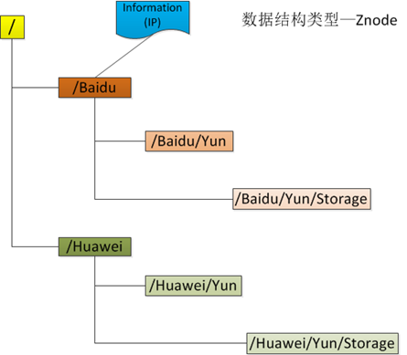
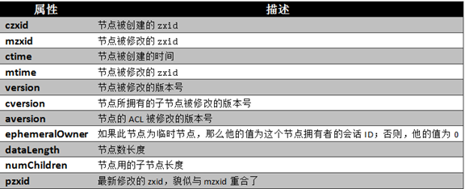
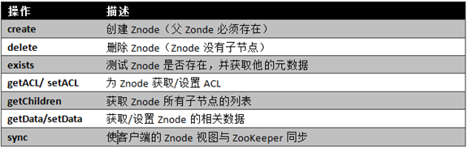
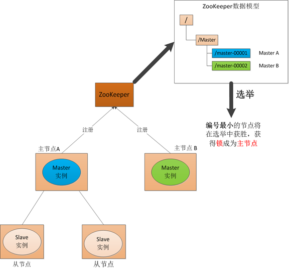

## ZooKeeper基本介绍

*摘自* [https://www.cnblogs.com/sunddenly/p/4033574.html][2ff3e8d9]

  [2ff3e8d9]: https://www.cnblogs.com/sunddenly/p/4033574.html "原文链接"

#### ZooKeeper数据模型Znode

ZooKeeper的数据模型，在结构上和标准文件系统的非常相似，都是采用这种树形层次结构，ZooKeeper树中的每个节点被称为—Znode。和文件系统的目录树一样，ZooKeeper树中的每个节点可以拥有子节点。但也有不同之处：

1. 引用方式
  Zonde通过路径引用，如同Unix中的文件路径。路径必须是绝对的，因此他们必须由斜杠字符来开头。除此以外，他们必须是唯一的，也就是说每一个路径只有一个表示，因此这些路径不能改变。在ZooKeeper中，路径由Unicode字符串组成，并且有一些限制。字符串"/zookeeper"用以保存管理信息，比如关键配额信息。

2. Znode结构
  ZooKeeper命名空间中的Znode，兼具文件和目录两种特点。既像文件一样维护着数据、元信息、ACL、时间戳等数据结构，又像目录一样可以作为路径标识的一部分。图中的每个节点称为一个Znode。 每个Znode由3部分组成:
  - stat：此为状态信息, 描述该Znode的版本, 权限等信息
  - data：与该Znode关联的数据
  - children：该Znode下的子节点

  ZooKeeper虽然可以关联一些数据，但并没有被设计为常规的数据库或者大数据存储，相反的是，它用来管理调度数据，比如分布式应用中的配置文件信息、状态信息、汇集位置等等。这些数据的共同特性就是它们都是很小的数据，通常以KB为大小单位。ZooKeeper的服务器和客户端都被设计为严格检查并限制每个Znode的数据大小至多1M，但常规使用中应该远小于此值。

1. 数据访问
  ZooKeeper中的每个节点存储的数据要被原子性的操作。也就是说读操作将获取与节点相关的所有数据，写操作也将替换掉节点的所有数据。另外，每一个节点都拥有自己的ACL(访问控制列表)，这个列表规定了用户的权限，即限定了特定用户对目标节点可以执行的操作。

1. 节点类型
  ZooKeeper中的节点有两种，分别为临时节点和永久节点。节点的类型在创建时即被确定，并且不能改变。

  - 临时节点：该节点的生命周期依赖于创建它们的会话。一旦会话(Session)结束，临时节点将被自动删除，当然可以也可以手动删除。虽然每个临时的Znode都会绑定到一个客户端会话，但他们对所有的客户端还是可见的。另外，ZooKeeper的临时节点不允许拥有子节点。

  - 永久节点：该节点的生命周期不依赖于会话，并且只有在客户端显示执行删除操作的时候，他们才能被删除

1. 顺序节点
  当创建Znode的时候，用户可以请求在ZooKeeper的路径结尾添加一个递增的计数。这个计数对于此节点的父节点来说是唯一的，它的格式为"%10d"(10位数字，没有数值的数位用0补充，例如"0000000001")。当计数值大于232-1时，计数器将溢出。

1. 观察
  客户端可以在节点上设置watch，我们称之为监视器。当节点状态发生改变时(Znode的增、删、改)将会触发watch所对应的操作。当watch被触发时，ZooKeeper将会向客户端发送且仅发送一条通知，因为watch只能被触发一次，这样可以减少网络流量。

##### Znode属性

##### Znode基本操作

- 更新ZooKeeper操作是有限制的。delete或setData必须明确要更新的Znode的版本号，我们可以调用exists找到。如果版本号不匹配，更新将会失败。
- 更新ZooKeeper操作是非阻塞式的。因此客户端如果失去了一个更新(由于另一个进程在同时更新这个Znode)，他可以在不阻塞其他进程执行的情况下，选择重新尝试或进行其他操作。
- 尽管ZooKeeper可以被看做是一个文件系统，但是为了便利，摒弃了一些文件系统地操作原语。因为文件非常的小并且是整体读写的，所以不需要打开、关闭或是寻地的操作。

#### Watch触发器
###### watch概述

    ZooKeeper可以为所有的读操作设置watch，这些读操作包括：exists()、getChildren()及getData()。
    watch事件是一次性的触发器，当watch的对象状态发生改变时，将会触发此对象上watch所对应的事件。
    watch事件将被异步地发送给客户端，并且ZooKeeper为watch机制提供了有序的一致性保证。
    理论上，客户端接收watch事件的时间要快于其看到watch对象状态变化的时间。

###### watch类型

ZooKeeper所管理的watch可以分为两类：

1. 数据watch(data  watches)：getData和exists负责设置数据watch
1. 孩子watch(child watches)：getChildren负责设置孩子watch

我们可以通过操作返回的数据来设置不同的watch：

2. getData和exists：返回关于节点的数据信息
2. getChildren：返回孩子列表

因此

1. 一个成功的**setData**操作将触发Znode的数据watch
2. 一个成功的**create**操作将触发Znode的数据watch以及孩子watch
3. 一个成功的**delete**操作将触发Znode的数据watch以及孩子watch

###### watch注册与处触发

    Watch由客户端所连接的ZooKeeper服务器在本地维护，因此watch可以非常容易地设置、管理和分派。
    当客户端连接到一个新的服务器时，任何的会话事件都将可能触发watch。
    另外，当从服务器断开连接的时候，watch将不会被接收。
    但是，当一个客户端重新建立连接的时候，任何先前注册过的watch都会被重新注册。

#### ZooKeeper选举过程

1. **master启动**
在引入了Zookeeper以后我们启动了两个主节点，"主节点-A"和"主节点-B"他们启动以后，都向ZooKeeper去注册一个节点。我们假设"主节点-A"锁注册地节点是"master-00001"，"主节点-B"注册的节点是"master-00002"，注册完以后进行选举，编号最小的节点将在选举中获胜获得锁成为主节点，也就是我们的"主节点-A"将会获得锁成为主节点，然后"主节点-B"将被阻塞成为一个备用节点。那么，通过这种方式就完成了对两个Master进程的调度。

2. **master故障**
如果"主节点-A"挂了，这时候他所注册的节点将被自动删除，ZooKeeper会自动感知节点的变化，然后再次发出选举，这时候"主节点-B"将在选举中获胜，替代"主节点-A"成为主节点。

3. **master恢复**
如果主节点恢复了，他会再次向ZooKeeper注册一个节点，这时候他注册的节点将会是"master-00003"，ZooKeeper会感知节点的变化再次发动选举，这时候"主节点-B"在选举中会再次获胜继续担任"主节点"，"主节点-A"会担任备用节点。

## ZooKeeper安装
安装入门：
[官方文档地址](https://zookeeper.apache.org/doc/current/zookeeperStarted.html)

###### 配置整理
